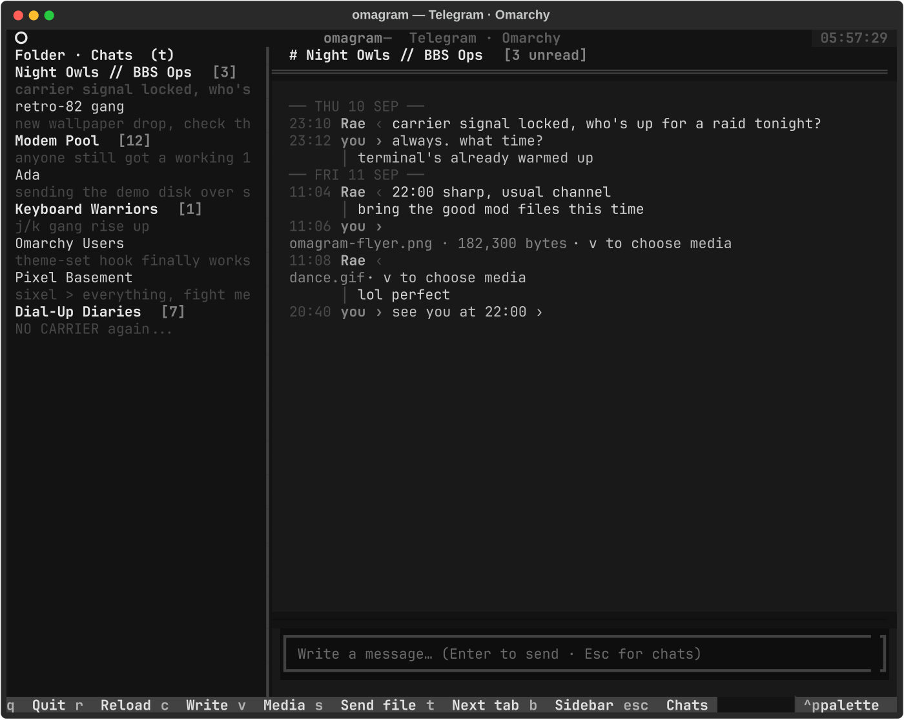

```text
╔════════════════════════════════════════════════════════════════════════════════════╗
║  ██████    ██      ██    ██████      ██████    ████████      ██████    ██      ██  ║
║██      ██  ████  ████  ██      ██  ██          ██      ██  ██      ██  ████  ████  ║
║██      ██  ██  ██  ██  ██████████  ██  ██████  ████████    ██████████  ██  ██  ██  ║
║██      ██  ██      ██  ██      ██  ██      ██  ██  ██      ██      ██  ██      ██  ║
║  ██████    ██      ██  ██      ██    ██████    ██    ██    ██      ██  ██      ██  ║
╠════════════════════════════════════════════════════════════════════════════════════╣
║  PROD: omagram (v0.1.0)                                         AUTHOR: @goarstne  ║
║  TYPE: Telegram TUI / Terminal Client               UI ENGINE: Textual + Telethon  ║
║  GRAPHICS: Sixel + Unicode Halfcell                TARGET: Linux / Foot / Omarchy  ║
║  REPO: github.com/goarstne/omagram                                   LICENSE: MIT  ║
╚════════════════════════════════════════════════════════════════════════════════════╝
```

> **OMAGRAM** — A fast, theme-aware, keyboard-first Telegram terminal client (TUI) for Linux & Omarchy with native Sixel/Halfcell raster graphics and instant QR-code authentication.

<p align="center">
  
</p>

---

## ⚡ Quick Start & Core Highlights

- 🎨 **Dynamic Theme Engine:** 100% theme-aware; seamlessly synchronizes with your active Omarchy desktop color palette (`colors.toml`) and terminal theme in real time.
- ⌨️ **Vim-Style Navigation:** Seamless keyboard workflow (`j`/`k` scroll, `Enter` open, `c` compose, `v` media, `Esc` back).
- 🖼️ **Native Terminal Graphics:** True pixel image and animation rendering with automatic Unicode Halfcell fallback.
- 🔒 **Instant QR Login:** Scan once with your Telegram mobile app — direct MTProto session, zero third-party servers.

```bash
git clone https://github.com/goarstne/omagram.git
cd omagram
uv run omagram
```

1. **Scan QR:** Scan the terminal QR code in Telegram (**Settings → Devices → Link Desktop Device**).
2. **Ready:** Launches directly into your chats!

---

## ⌨️ Controls & Keybindings

| Key | Action |
| :--- | :--- |
| `j` / `↓` | Next chat / Cursor down |
| `k` / `↑` | Previous chat / Cursor up |
| `Enter` / `o` | Open selected chat |
| `c` | Compose message (focus text input) |
| `Enter` *(in input)* | Send message |
| `Escape` | Unfocus input / return to chat list |
| `v` | Inspect latest image/animation |
| `b` / `Ctrl+b` | Toggle chat sidebar |
| `r` | Reload chats and messages |
| `i` | Show demoscene release credits card |
| `q` / `Ctrl+c` | Exit Omagram |

---

## 📡 Features & Architecture

- 🎨 **Live Omarchy & Terminal Theming:** Automatically reads your desktop theme from `~/.local/state/omarchy/current/theme/colors.toml`. Custom palette colors adapt live across all widgets without restarting the client.
- ⌨️ **Keyboard-Driven Workflow:** Designed from the ground up for power users with vim-like muscle memory.
- 🖼️ **Native Terminal Rendering:** Crisp inline previews with automatic Unicode Halfcell fallback.
- 🔒 **Direct Encrypted MTProto:** Direct peer-to-server TLS connection to official Telegram datacenters. No proxy, no middlemen, no data collection. Session keys are stored locally at `~/.local/state/omagram/`.
- 🎛️ **Omarchy Desktop Integration:** Includes an `omarchy-shell` / Quickshell status bar widget.
- 🛡️ **Defense-in-Depth Hardening:** External binaries (`ffmpeg`) are resolved from a fixed trusted path list, never a bare `PATH` lookup; every state/cache/log directory is opened via `dir_fd`-anchored syscalls so a swapped directory can't redirect writes after the fact; downloads are capped both by declared size and mid-transfer.

---

## 💾 Installation & Requirements

- **Python 3.12+** and [uv](https://docs.astral.sh/uv/) (recommended)
- **Foot Terminal** (or any modern terminal emulator)

```bash
# Clone the repository
git clone https://github.com/goarstne/omagram.git
cd omagram

# Sync dependencies and connect
uv sync
uv run omagram
```

---

## 🎛️ Omarchy Bar Widget Integration

Omagram includes a native launcher widget for the Omarchy status bar.

### Install via Omarchy CLI
```bash
omarchy plugin add https://github.com/goarstne/omagram.git --enable
```

### Remove
```bash
omarchy plugin remove goarstne.omagram
```

### Manual / Local Development
```bash
git clone https://github.com/goarstne/omagram.git ~/.config/omarchy/plugins/goarstne.omagram
omarchy plugin validate ~/.config/omarchy/plugins/goarstne.omagram
omarchy-shell shell rescanPlugins
omarchy plugin enable goarstne.omagram
```

Clicking the Telegram status icon (`󰗊`) in your Omarchy bar spawns Omagram directly inside your terminal workspace.

---

## 🔧 Configuration & Custom API Keys (Optional)

Omagram connects seamlessly out-of-the-box using standard desktop client credentials.

If you prefer using your own custom developer credentials from [my.telegram.org](https://my.telegram.org):

1. Create `~/.config/omagram/.env` (or `.env` in the project root):
   ```env
   TG_API_ID=12345678
   TG_API_HASH=your_api_hash_here
   ```
2. Or invoke the interactive setup wizard:
   ```bash
   uv run omagram setup
   ```

---

## 🔍 Diagnostics & Logs

Omagram logs diagnostics to a rotating local logfile at `~/.local/state/omagram/omagram.log`. Passwords, private session keys, and message contents are never recorded.

```bash
# Launch with verbose debug diagnostics
uv run omagram --debug run

# Monitor connection stream live
tail -f ~/.local/state/omagram/omagram.log

# Enable detailed MTProto network traces
OMAGRAM_LOG_TELETHON=1 uv run omagram --debug run
```

### Test Suite & Media Probes

```bash
# Execute unit test suite
uv run python -m unittest discover -s tests -v

# Regenerate demo screenshot with simulated data
uv run python scripts/demo_screenshots.py

# Offline terminal graphics capability probe
uv run python -m telegram_tui.media_probe /path/to/test_image.jpg
```

---

## 📜 License

MIT License. Copyright (c) 2026 Carsten (@goarstne).
