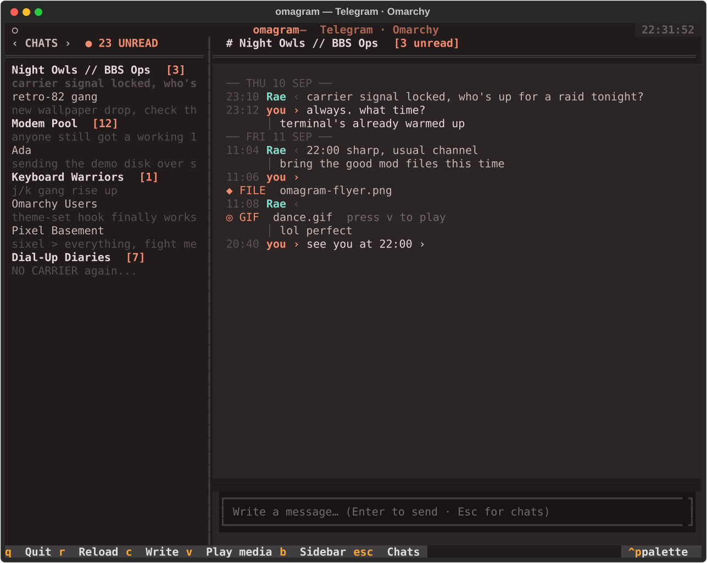

# omagram

> Tastaturorientierter Telegram-Terminal-Client (TUI) für Omarchy und Linux mit nativer Sixel- und Halfcell-Medienvorschau.

<p align="center">
  
</p>

---

## ⚡ TL;DR – In 30 Sekunden startklar

Kein Einrichten von API-Keys auf `my.telegram.org` nötig. Klonen, starten, QR-Code scannen:

```bash
git clone https://github.com/goarstne/omagram.git
cd omagram
uv run omagram
```

1. **QR-Code scannen:** Scan den angezeigten QR-Code in Telegram unter **Einstellungen → Geräte → Desktopgerät verknüpfen**.
2. **Fertig:** Die TUI startet direkt nach dem Scan nahtlos in deine Chats!

---

## ✨ Features

- ⌨️ **Keyboard-first Navigation:** Vim-inspirierte Navigation (`j`/`k`, `Enter`, `c` zum Schreiben, `Escape` zurück zur Liste).
- 🖼️ **Native Terminal-Grafiken:** Bild- und GIF-Vorschauen via nativem Sixel (in Foot) oder Unicode-Halfcell-Fallback.
- 🎬 **Lazy Medien-Wiedergabe:** Telegram-Videos und GIFs mit `v` direkt in `mpv` abspielen (GIFs automatisch in Endlosschleife).
- 🔴 **YouTube-Integration:** Automatische Thumbnail-Erkennung von YouTube-Links mit direktem Abspielen über `v` in `mpv` (Fallback: Browser).
- 💬 **Schneller Chat:** Chatverläufe und Dialoge werden flüssig im Hintergrund geladen; neue Nachrichten aktualisieren live.
- 🎨 **Omarchy-Themes:** Automatische Übernahme der aktiven Omarchy-Farbpalette (`~/.local/state/omarchy/current/theme/colors.toml`).
- 🔒 **100 % Privat & Sicher:** Direkte, Ende-zu-Ende verschlüsselte MTProto-Verbindung mit den Telegram-Servern. Keine Zwischenserver, keine Drittanbieter. Die Session liegt geschützt auf deinem Rechner (`~/.local/state/omagram/`).
- 🧩 **Omarchy-Bar-Widget:** Schneller Start direkt aus der Statusleiste von `omarchy-shell`.

---

## ⌨️ Tastatur-Steuerung

| Taste | Aktion |
| :--- | :--- |
| `j` / `↓` | Nächster Chat / Cursor nach unten |
| `k` / `↑` | Vorheriger Chat / Cursor nach oben |
| `Enter` / `o` | Ausgewählten Chat öffnen |
| `c` | Nachricht schreiben (Eingabefeld fokussieren) |
| `Enter` (im Feld) | Nachricht absenden |
| `Escape` | Eingabefeld verlassen / Fokus zurück auf Chatliste |
| `v` | Neuestes Video/GIF oder YouTube-Link in `mpv` abspielen |
| `b` / `Ctrl+b` | Chatleiste ein- / ausklappen |
| `r` | Chats und Nachrichten neu laden |
| `i` | Info-Dialog anzeigen |
| `q` / `Ctrl+c` | Omagram beenden |

---

## 🚀 Installation & Voraussetzungen

- **Python 3.11+** und [uv](https://docs.astral.sh/uv/) (empfohlen)
- **mpv** (optional, für Video- und GIF-Wiedergabe): `sudo pacman -S mpv`
- **Foot Terminal** (empfohlen für native Sixel-Bilder)

```bash
# Repository klonen
git clone https://github.com/goarstne/omagram.git
cd omagram

# Abhängigkeiten synchronisieren und starten
uv sync
uv run omagram
```

---

## 🧩 Omarchy-Bar-Plugin aktivieren

Omagram bringt ein natives Widget für die Omarchy-Statusleiste mit:

```bash
mkdir -p ~/.config/omarchy/plugins/local.omagram
cp omarchy-plugin/* ~/.config/omarchy/plugins/local.omagram/
omarchy plugin validate ~/.config/omarchy/plugins/local.omagram
omarchy-shell shell rescanPlugins
omarchy plugin enable local.omagram
```

Ein Klick auf das Telegram-Icon in der Statusleiste öffnet Omagram im Terminal.

---

## ⚙️ Konfiguration & Eigene API-Keys (Optional)

Standardmäßig nutzt Omagram die offiziellen, öffentlich bekannten Telegram-Desktop-Credentials (`api_id=2040`), damit keine manuelle Registrierung nötig ist. 

Wer für seinen Account lieber eigene App-Credentials von [my.telegram.org](https://my.telegram.org) verwenden möchte, kann diese jederzeit hinterlegen:

1. Datei anlegen: `~/.config/omagram/.env` (oder `.env` im Projektordner)
2. Werte eintragen:
   ```env
   TG_API_ID=12345678
   TG_API_HASH=dein_api_hash
   ```
3. Alternativ den Einrichtungsassistenten starten:
   ```bash
   uv run omagram setup
   ```

---

## 🛠️ Diagnose & Debugging

Omagram schreibt standardmäßig ein rotierendes Diagnose-Log nach `~/.local/state/omagram/omagram.log` (Zugangsdaten, Passwörter und Nachrichteninhalte werden niemals mitgeloggt).

```bash
# Debug-Modus starten
uv run omagram --debug run

# Log live verfolgen
tail -f ~/.local/state/omagram/omagram.log

# Ausführliche Telethon-Netzwerk-Logs aktivieren
OMAGRAM_LOG_TELETHON=1 uv run omagram --debug run
```

### Tests & Tooling

```bash
# Tests ausführen
uv run python -m unittest discover -s tests -v

# Screenshot neu rendern (nutzt Mock-Daten, keine echten Chats)
uv run python scripts/demo_screenshots.py

# Offline-Sixel-Grafiktest im Terminal
uv run python -m telegram_tui.media_probe /pfad/zum/bild.jpg
```

---

## 📄 Lizenz

MIT Lizenz.
